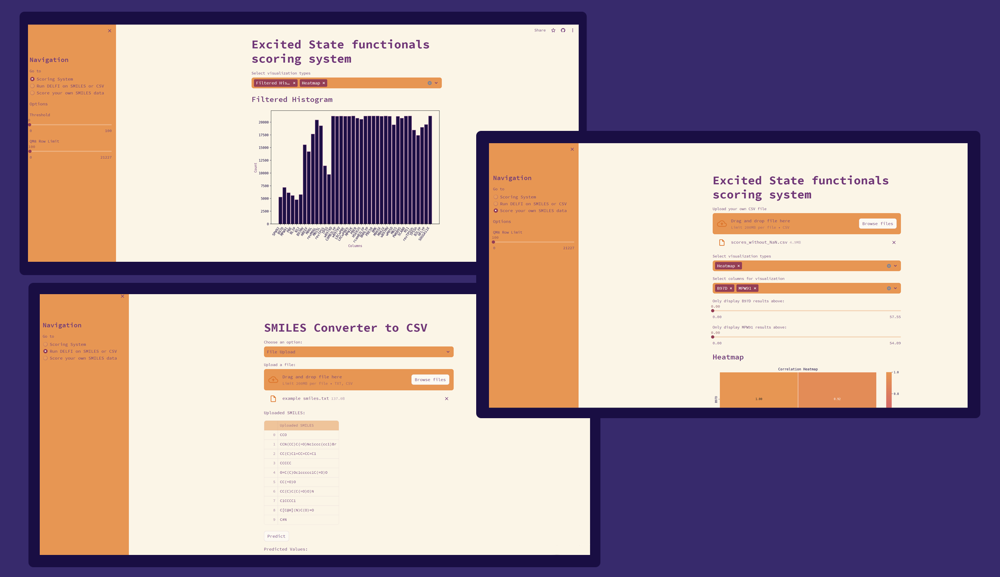

# DELFI Data Visualizer  &nbsp;&nbsp; [](https://delfi-functional-predictor.streamlit.app/)




## Description

The DELFI Data Visualizer is a streamlit tool designed to facilitate data visualization and exploration for the DELFI project.

## Navigation
There are three pages which can be accessed from the sidebar on the left,

- Scoring System

    - Here you can get visualisations based on a pre-determined CSV file
<br>
<br>
- Run DELFI on SMILES or CSV

    - Here you can get predictions based on SMILES located in files or manually entered.
<br>
<br>
- Score your own SMILES data

    - Here you can upload the predictions you recieved and get visualisations based on that data.


## Features

- Interactive Data Visualization: The visualizer allows users to explore the data through interactive charts, graphs, and maps, providing a deeper understanding of the DELFI project's findings.

- Flexible Data Selection: Users can select specific data sets, and parameters to customize their visualizations.

- Export and Share: The visualizations data can be exported in CSV format, allowing users to share their insights and findings with others.

## Running Locally

Follow these instructions to get a copy of the project up and running on your local machine for development and testing purposes:

1. 'Prerequisites': Ensure you have [Python](https://python.org) installed on your machine.

2. 'Clone the repository': Use the following command to clone the repository to your local machine.

```bash
$ git clone https://github.com/aspuru-guzik-group/DELFI.git
```

3. 'Install dependencies': Make sure you're in the root directory then use the following command to install the dependencies.

```bash
$ pip install -r requirements.txt
```

3. 'Run the application':  Run the following command in the terminal and navigate to `http://localhost:8501`
```bash 
$ streamlit run ./app.py
```